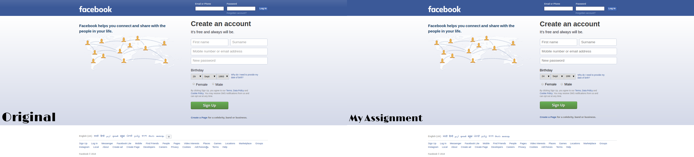

# First Assignment
I have remade the homepage of [facebook.com](https://www.facebook.com) to learn basic HTML and CSS.

## Things: I learned
 * To link external CSS in HTML document
 * To load external fonts using @font-face
 * To align element left/right using floats
 * To effectively load background images

## Demo

